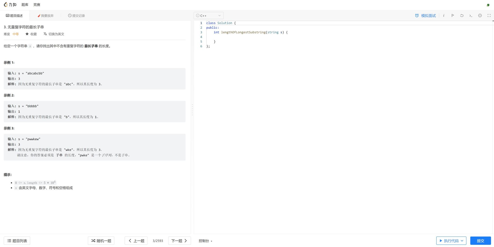

# Leetcode-cleaner

> 力扣（Leetcode-cn）清理大师

> 2022/10：Leetcode更新了刷题界面，此脚本暂未适配，您可以关闭脚本并刷新后，从头像处点击**回到旧版**，回到截图中的版本，即可正常使用。

本脚本旨在消除力扣刷题界面的无用信息，并仿照OJ对力扣进行改动。

主要改动如下：

* 删除提交错误时的**错误用例显示**，删除执行代码时的**正确代码运行结果**（即只有程序的输出，没有正确结果进行对照）【一般OJ设置】
* 关闭评论区
* 关闭笔记功能
* 删除顶栏的无用按钮（学习、讨论、求职、商店、Plus会员、我是面试官、APP、通知）
* 删除无效的题目信息（相关企业、总提交次数、贡献者等）
* 删除其他无用的按钮（点赞、分享、接受动态、反馈）
* 删除PLUS会员功能（调试器、智能模式）
* 重命名`题解`为`我要放弃`，使用激将法提高AC率

修改后样式如下：

* 提交结果

  

* 运行结果：

  

**脚本内有详尽注释，您可以根据需求自定义脚本**

## 安装方法：

**需要脚本管理软件，如`tampermonkey`等**

1. （推荐）从[Greasyfork](https://greasyfork.org/zh-CN/scripts/443419-%E5%8A%9B%E6%89%A3-leetcode-cn-%E6%B8%85%E7%90%86%E5%A4%A7%E5%B8%88)直接下载安装
2. 或从当前位置下载源代码

